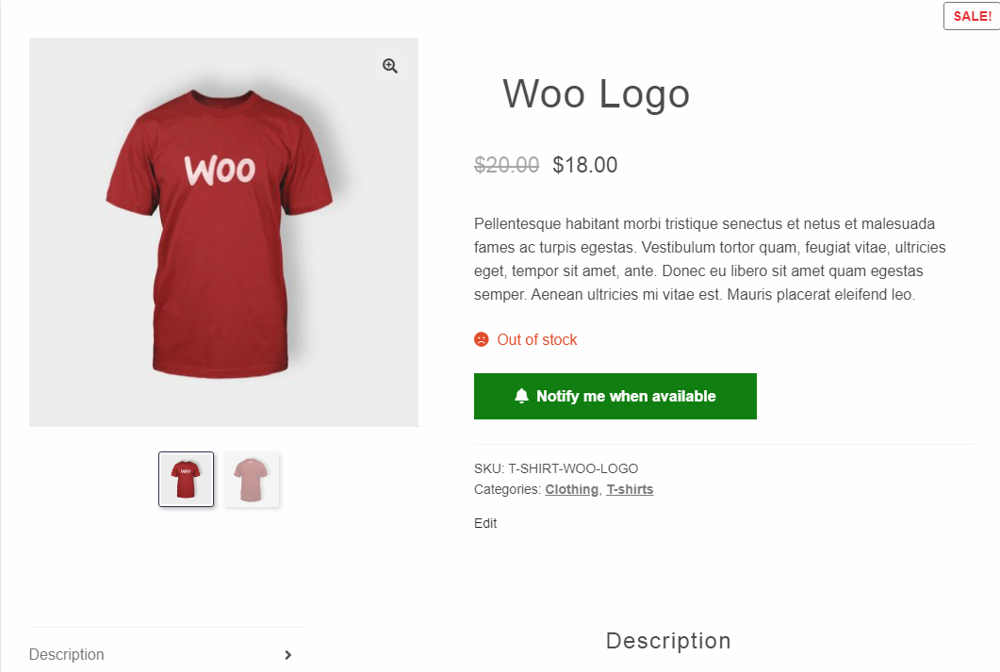
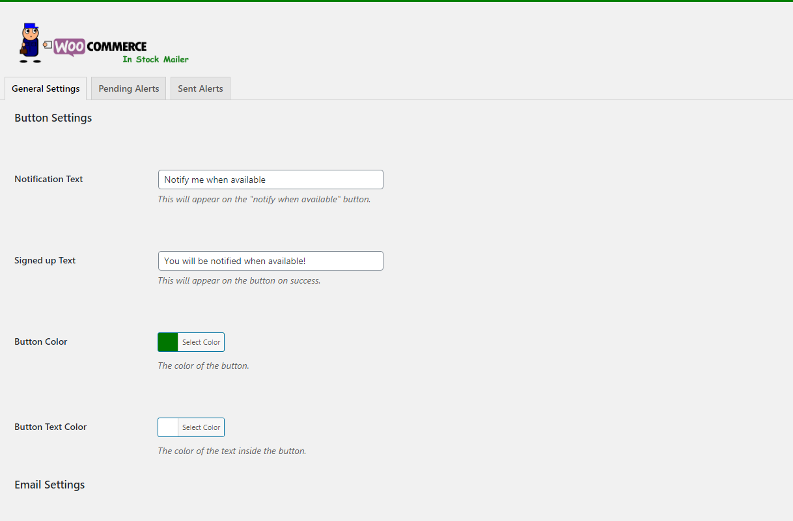
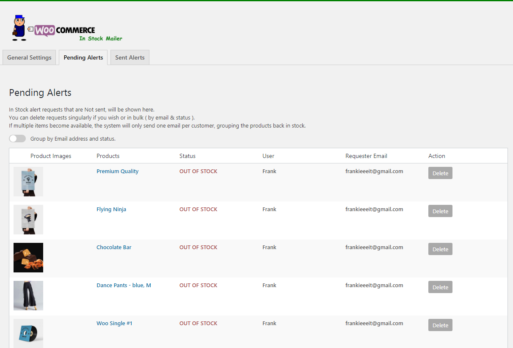
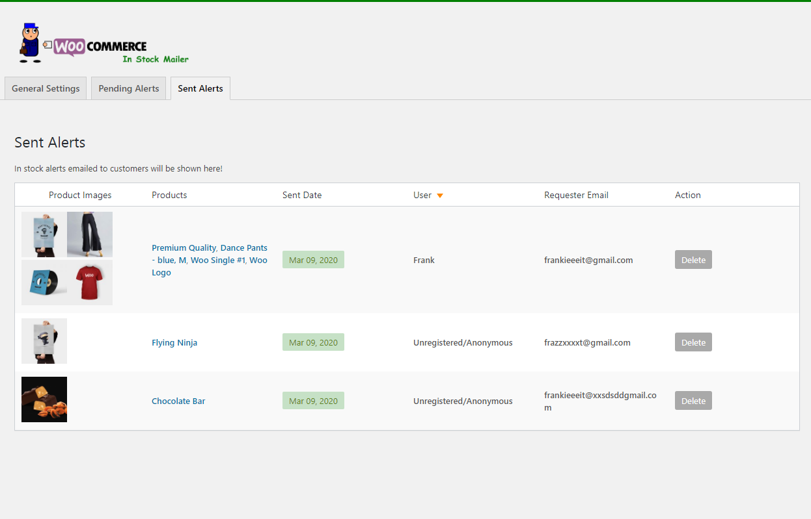

# In Stock Mailer For WooCommerce

> Sends in-stock alert to your customers automatically, adds custom alert button and email.

[Plugin Home Page](https://wordpress.org/plugins/in-stock-mailer-for-woocommerce/)

## How To Install
- Download the zip file only
- Go to your admin page on your WordPress installation
- Add New -> Upload Plugin -> Choose File -> Install
- Once installed go to Settings -> In Stock Mailer WC and personalize it.
- At the bottom of General Settings run "Send Email Test"

## Screenshots

## FAQ

- **Do I have to configure anything to use it?**
    - Yes and no. The plugin works out of the box but you should add an header image to your email.

- **When are the in stock email alerts sent?**
    - Normally it runs at intervals of 8 hours. If your website has a low traffic rate consider adding a server based cron job.

- **The plugin isn’t sending any email, what do I do?**
    - If emails are not being sent the first step is to send an email test. You can do so from the General Settings page. This plugin requires you to have a transactional email service in place already!

- **What is a transactional mail service?**
    - It’s a service offered by a company that allows WordPress to send “individual emails”. There are many out there such as SendGrid, mailgun etc.; Some of which have free plans too.

- **Will I get spam requests?**
    - The plugin offers some degree of protection against spam! Bots will have a hard time sending fake requests but some may get through. In the future I might implement captcha if needed/requested.

- **Is there any extra futures?**
    - At the moment there isn’t any paid option available. Depending on requests and feedbacks I will be happy to add new free features in the future! Please hit me up with suggestions.

---
